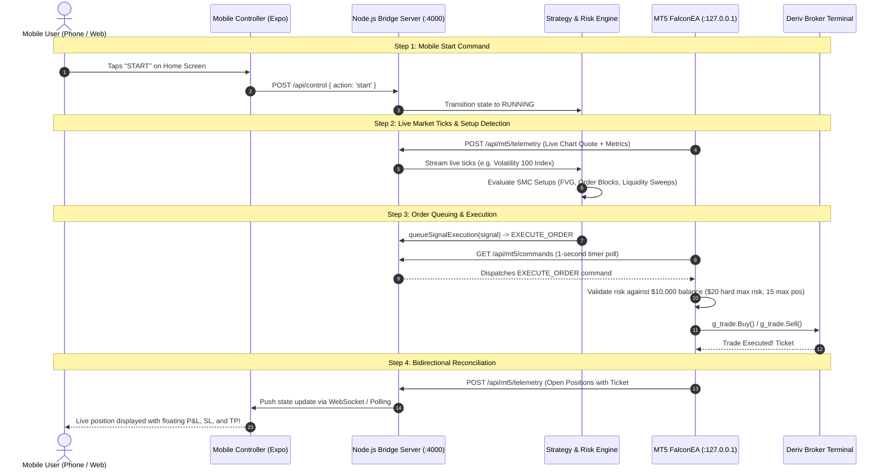

# Derived Arbitrage — Deriv Synthetic Indices


A personal Android controller for a Deriv MT5 EA trading Volatility, Boom, Crash, and Step synthetic indices. This project is structured in validated phases — no live trading until every gate passes.

> **Demo only.** This codebase currently connects to a mock control server and the Deriv WebSocket API for read-only market profiling. No trades, no real orders, no broker credentials stored here.

---

## Project Status

| Phase | Description | Status |
|---|---|:---:|
| 1 | Demo mobile controller + mock server |  |
| 2 | Market Profiler — live Deriv WebSocket data |  |
| 3 | Strategy engine (Falcon FX / SMC signals) |  |
| 4 | MQL5 EA with independent risk engine |  |
| 5 | VPS bridge + HTTPS/WSS auth |  |
| 6 | Live activation gate (demo-proven only) |  |
| 7 | EAS Standalone APK Release & Over-The-Air (OTA) Pipeline |  |

---

## Instruments

| Symbol | Group | Code |
|--------|-------|------|
| Volatility 10 Index | Volatility | `R_10` |
| Volatility 50 Index | Volatility | `R_50` |
| Volatility 75 Index | Volatility | `R_75` |
| Volatility 100 Index | Volatility | `R_100` |
| Volatility 100 (1s) Index | Volatility | `1HZ100V` |
| Step Index | Step | `stpRNG` |
| Boom 500 Index | Boom | `BOOM500` |
| Boom 1000 Index | Boom | `BOOM1000` |
| Crash 500 Index | Crash | `CRASH500` |
| Crash 100 Index | Crash | `CRASH300` |

---

## Mobile Development Standards (Rule 15)

- **Target Platforms**: Android (first), iOS
- **Navigation Chrome**: Floating pill bottom navigation bar with a smooth animated sliding underline indicator (`Animated.spring`) positioned directly below the active tab, dynamically accounting for OS chrome (Android: 48px gesture chrome; iOS: 34px home indicator)
- **App Bar & Header**: Dedicated App Bar (`56px` Android / `96px` iOS) respecting device status bar height so device time and chrome never overlay header titles
- **Grid & Spacing**: 4-column stretch layout, 16px margins & gutters, 8px grid spacing (8, 16, 24, 32, 48, 56, 64)
- **Touch Targets**: Minimum 48×48dp (Android) / 44×44pt (iOS) across all buttons, tab items, and switches
- **Color System**: 60% Background (`#080808` Pitch Black), 30% Panel (`#161616` Matte Charcoal), 10% Accent (`#FF6B00` Vivid Electric Orange), Text (`#FFFFFF` Pure White)
- **Safe Area Insets**: Handled via `react-native-safe-area-context` (`SafeAreaProvider` + `SafeAreaView` with explicit top/side edges)
- **Keyboard Avoidance & Input Accessibility**: Zero text input keyboard overlap across all screens and dialogs. Managed via Android `softwareKeyboardLayoutMode: "resize"`, root and modal `KeyboardAvoidingView` wrappers, `keyboardShouldPersistTaps="handled"`, `keyboardDismissMode="on-drag"`, and bottom offset padding to guarantee all fields remain visible above software keyboards and bottom chrome
- **No Status Badges**: Strictly zero status badges or indicator tags (e.g. READ ONLY, DEMO ONLY, STOPPED, REVIEW, OK) in component UIs (Rule 16)

---

## Quick Start

```powershell
npm install
npm run dev
```

Scan the QR code from Expo Go on Android. The app starts on port **8082**.

If you get port conflicts, run this first:

```powershell
@(8081, 8082, 4000) | ForEach-Object { $port = $_; netstat -ano | Select-String ":$port\s" | ForEach-Object { $procId = ($_ -split '\s+')[-1]; if ($procId -match '^\d+$') { Stop-Process -Id ([int]$procId) -Force -ErrorAction SilentlyContinue } } }
```

---

## Network Connectivity & Connection Resilience

When switching between Wi-Fi networks (e.g. home vs. office) or running on different clients (web browser, Android phone, Android emulator), IP addresses can change. The mobile controller includes multi-layer connection resilience:

1. **Web Browser Automatic Host Matching**:
   - When opened in a browser (e.g., `http://localhost:8082` or `http://10.186.129.215:8082`), the app automatically targets `http://${window.location.hostname}:4000`, avoiding stale LAN IPs.
2. **Multi-Host Auto-Discovery (`src/api.ts`)**:
   - Requests enforce a strict 3,500ms timeout with `AbortController` to eliminate infinite loading spinners.
   - If the initial host is unreachable, `probeCandidateUrls()` automatically tests known candidate endpoints in parallel/sequence (`http://10.186.129.215:4000`, `http://localhost:4000`, `http://127.0.0.1:4000`, `http://10.0.2.2:4000`) and self-heals by switching to the first responding host.
3. **Connection Recovery Screen (`App.tsx`)**:
   - If the server bridge cannot be reached, the app displays a responsive recovery screen with:
     - Error diagnostics and current target URL
     - Quick-switch host chips for instant one-tap switching
     - Custom URL input field
     - **Launch Offline Demo** mode button, allowing complete offline inspection of the UI without network dependency.
4. **Profile Bridge Synchronization (`ProfileScreen.tsx`)**:
   - Setting `bridgeUrl` in Profile instantly synchronizes `API_BASE_URL` and persists across app restarts via AsyncStorage.

---

## Application Sections (5 Tabs)

### 1. Home Tab (Cybernetic Robot Command Center)
- **High-tech Robot Hero Banner**: Futuristic cybernetic AI robot character with gradient identity overlay
- **3-Button Quick Action Dock**:
  - `START / PAUSE`: Primary execution toggle with tactile SVG action indicators. Remains responsive with automatic fallback execution dispatch.
  - `QUOTES`: Instant sliding shortcut to the live Profiler tab with market spreads & pips
  - `STOP`: Immediate emergency stop halts all automated signals safely
- **Continuous Hybrid Connectivity & Polling Backup**:
  - Background 3,500ms HTTP polling fallback ensures the controller stays synchronized and online even if OS-level cleartext restrictions or mobile networks drop WebSocket connections.
  - WebSocket errors trigger automated silent HTTP state re-validation instead of abruptly stranding the app in an offline loop.
  - Global `setApiBaseUrl` and `ProfileScreen` automatically sanitize AsyncStorage to purge stale cached LAN addresses (`192.168.1.42`) and prioritize the active Wi-Fi subnet (`10.186.129.215:4000`).
- **Bridge Synchronizing Notice & Tactile SYNC**:
  - When awaiting connection, an inline notice displays the target bridge URL along with a tactile `SYNC` action for instant manual polling.
- **Active Robot Instance Card**:
  - Robot avatar thumbnail with neon orange status ring
  - Live monospace terminal console line (`>> [timestamp] Signal engine active · Monitoring 10 synthetic feeds`)
  - Server bridge heartbeat indicator
- **Performance & Portfolio KPIs**: Large active equity metric, Today P&L, Max Drawdown, and position counters
- **Falcon FX Execution Parameters**: SMC signal engine rules, risk per trade, stop loss model, and daily loss locks

### 2. Controller Tab
- Detailed Risk Guardrails: Absolute equity floor ($15.00), default risk/trade ($0.10), hard max, daily/weekly loss locks, margin ceiling
- **Non-Blocking State Synchronization**: Renders all guardrails, floor metrics, and gate inspection cards immediately without blocking on network spinners
- **Bridge Synchronizing Banner**: Inline offline indicator with tactile `SYNC` action for instant manual polling
- Safety Intervention: Emergency Exit button with double confirmation
- Simulated positions list with side, P&L, and simulated indicators
- Monitored instruments: Compact 3-item view with internal nested scroll and custom Uiverse `ToggleSwitch`

### 3. Profiler & SMC Signals Tab
- **Dual-View Segment Control with Animated Spring Slider**:
  - `PROFILES`: Live spot price, median & P95 spread distributions, real-time tick velocity sparkline, and affordability indicators across all 10 synthetic instruments.
  - `SMC SIGNALS`: Live real-time feed of active and recent trade setups generated by the Falcon FX & SMC engine (Break of Structure, Liquidity Sweeps, CHoCH, Fair Value Gap Retests) with direction, entry, SL, TP, and R:R ratios.
  - **Animated Spring Slider Indicator**: Sleek `#26140E` indicator pill with `#FF6B00` border that glides fluidly between `PROFILES` and `SMC SIGNALS` with spring physics (`friction: 8, tension: 65`).
- **Hardware-Accelerated Horizontal Slide Transition**:
  - Full-width dual-pane sliding track driven by `Animated.spring` on `translateX` (`0 -> -viewportWidth`).
  - View transitions slide horizontally across the screen without abrupt jumping, paired with synchronized cross-fade opacity curves (`profilesOpacity` & `signalsOpacity`).
  - Strict touch isolation (`pointerEvents='none'` on the inactive off-screen pane) prevents phantom interactions during or after transitions.
- **Adaptive Dynamic Height Spring**:
  - Self-measuring layout listeners continuously determine the natural heights of both panes (`profilesHeight` and `signalsHeight`).
  - Container height smoothly animates via `heightAnim`, ensuring the footer neatly glides into position without awkward blank gaps or content clipping.
- **Instant Non-Blocking Initialization (`DEFAULT_PROFILER_SNAPSHOT`)**:
  - Automatically initializes with high-fidelity baseline profiles for all 10 synthetic index symbols (`R_10`, `R_50`, `R_75`, `R_100`, `1HZ100V`, `stpRNG`, `BOOM500`, `BOOM1000`, `CRASH500`, `CRASH300`).
  - Completely eliminates blocking full-screen loading spinners (`Connecting to Deriv API... just loads forever`).
- **Resilient Network Timeouts & Stale IP Guard**:
  - Replaces raw untimed fetch calls with `getProfilerStatus()` in `src/api.ts`, backed by a 3,500ms `AbortController` timeout threshold.
  - Automatically filters out stale/cached LAN host candidates (such as `192.168.1.42`) and defaults to the active Wi-Fi subnet (`10.186.129.215:4000`).
  - Subscribes to runtime `onApiBaseUrlChange` events to dynamically re-synchronize when candidate probes or settings update.
- **Inline Error Banner & Tactile Retry**:
  - If network or Deriv bridge is temporarily unreachable, an inline non-blocking banner indicates the error and provides a tactile `RETRY` button while preserving full access to symbol cards and structure modals.
- **SMC Market Structure Inspection Modal (`SmcStructureModal`)**:
  - Tap `SMC Structure` on any instrument card to inspect real-time Trend Bias (`BULLISH`/`BEARISH`/`RANGING`), last Break of Structure (BOS), Change of Character (CHoCH), active unmitigated Fair Value Gaps (FVG), dynamic ATR, and a live SVG candlestick sparkline.

### 4. Activity Tab
- Full chronological event and audit log
- Real-time timestamps and status category markers
- Complete audit trail of automation state transitions, trade events, and risk limit checks

### 5. Profile Tab
- Account configuration and connectivity hub
- Deriv API credentials: App ID configuration and Read-only API Token
- Test Deriv Connection button verifying live WebSocket status
- MT5 VPS Bridge configuration: Server host, MT5 Server (`DerivSVG-Server-03`), MT5 Account login
- Test Bridge Ping button verifying latency
- Secure local persistence via `@react-native-async-storage/async-storage`

---

## Configuration

Copy `.env.example` to `.env` and edit with your Wi-Fi IPv4 address (find with `Get-NetIPAddress -AddressFamily IPv4`):

```env
# Your computer's Wi-Fi LAN IP (for physical Android device connectivity)
EXPO_PUBLIC_API_URL=http://<YOUR_WIFI_IP>:4000

# Server ports
CONTROL_SERVER_HOST=0.0.0.0
CONTROL_SERVER_PORT=4000

# Deriv WebSocket API (Phase 2)
DERIV_APP_ID=1089           # Public demo app_id — works without registration
DERIV_API_TOKEN=            # Optional read-only token for full symbol data
```

To get real symbol data (spot prices, pip sizes), create a **Read-only** API token at [app.deriv.com/account/api-token](https://app.deriv.com/account/api-token) and set `DERIV_API_TOKEN` in `.env`. **Never** set a write-access or trading token here.

### Understanding Broker Credentials & Identifiers

A common point of confusion when configuring the Profile screen or MT5 bridge is distinguishing between **Deriv App ID**, **MetaQuotes ID**, and **MT5 Trading Account Credentials**:

| Credential / Identifier | Default / Example | Where It Is Found | What It Is Used For |
|---|---|---|---|
| **Deriv App ID** | `1089` *(Default)* | Pre-filled by default. Optional: [app.deriv.com/account/api-token](https://app.deriv.com/account/api-token) | Deriv's universal public WebSocket gateway identifier for market data & tick feeds. **No user registration required — keep `1089` as-is.** |
| **MetaQuotes ID (MQID)** | `8-character alphanumeric` (e.g., `A1B2C3D4`) | MT5 Mobile App: *Settings* $\rightarrow$ *Messages* (or MT5 Desktop: *Tools* $\rightarrow$ *Options* $\rightarrow$ *Notifications*) | Used **strictly** by MetaTrader for mobile push notifications to your smartphone. It is **not** an API identifier and cannot connect to WebSocket feeds. |
| **MT5 Account Login** | `10293847` *(Numeric)* | [Deriv Trader's Hub](https://app.deriv.com) under *CFDs* $\rightarrow$ *Deriv MT5* | Your actual MetaTrader 5 trading account number. Used for logging into the MT5 terminal and configured under `ACCOUNT IDENTIFIER` in the Profile tab. |
| **Deriv MT5 Server** | `DerivSVG-Server-03` or `Deriv-Demo` | [Deriv Trader's Hub](https://app.deriv.com) under *CFDs* $\rightarrow$ *Deriv MT5* | The broker trade server assigned to your account. Configured under `MT5 SERVER` in the Profile tab. |
| **Deriv API Token** | *(Optional)* | [app.deriv.com/account/api-token](https://app.deriv.com/account/api-token) | Optional **Read-only** token to unlock expanded symbol lists. Never create or paste a write-scope token here. |

---

## Risk Policy

### Standard & Demo Accounts ($10,000 Baseline)

| Guard | Value | Ratio / Pct | Operational Function |
|---|---:|---:|---|
| **Starting Balance** | $10,000.00 | 100% | High-capacity institutional baseline balance |
| **Absolute Equity Floor** | $8,500.00 | 85.0% | Emergency circuit-breaker closes all trades and locks engine |
| **Maximum Total Drawdown** | $1,500.00 | 15.0% | Cumulative portfolio loss threshold |
| **Hard Max Risk / Trade** | $20.00 | 0.20% | Every signal is strictly sized to the $20 Hard Maximum Risk |
| **Daily Loss Lock** | $100.00 | 1.0% | Daily circuit-breaker halts trading until 00:00 UTC |
| **Weekly Loss Lock** | $300.00 | 3.0% | Cumulative weekly loss lock |
| **Max Open Positions** | 15 | — | Arbitrage capacity allowing up to 15 concurrent market executions |
| **Max Margin Usage** | 20.0% | 20.0% | Max allocated margin cap across all open positions |
| **Max Daily Trades** | 100 | — | Daily ceiling for multi-position arbitrage executions |

### Micro Account Mode ($20.00 Baseline)

| Guard | Value |
|---|---:|
| Starting balance | $20.00 |
| Absolute equity floor | $15.00 |
| Max total loss | $5.00 |
| Default risk / trade | $0.10 |
| Hard max risk / trade | $0.20 |
| Daily loss lock | $0.40 |
| Weekly loss lock | $1.00 |
| Max open positions | 1 |
| Max margin usage | 20% |
| Profit cap | None |

---

## Architecture

```
Android App (Expo Go / Expo React Native)
        │  HTTPS REST + Authenticated WSS (Bearer JWT / API Key)
        ▼
VPS Control Bridge Server (Node.js · VPS / Host:4000)
        │  /api/auth/*, /api/gates/*, /api/state, /api/control, /api/profiler/*, /api/mt5/*
        ├─── Security & Auth Manager (Phase 5: JWT, API Key, Device Binding, Rate Limiting)
        ├─── Live Activation Gate Engine (Phase 6: 5 Non-Negotiable Quantitative Gates)
        ├─── Controller Store & State Machine (Phase 1: Invariant Guardrails & State Locks)
        ├─── Deriv WebSocket Client (Phase 2: Live ticks, median/P95 spread profiling)
        ├─── Strategy Engine (Phase 3: Candle aggregation, SMC BOS/CHoCH/FVG, Falcon sweeps)
        └─── MT5 Server Bridge (Phase 4: Telemetry ingestion, command queueing, watchdog)
                  │  HTTP WebRequest (x-api-key authenticated)
                  ▼
MetaTrader 5 Terminal (DerivSVG-Server-03)
        └─── FalconEA.mq5 (MQL5 Expert Advisor with On-Chart HUD)
                  ├─── RiskEngine.mqh (1,243-Line Client-Side Invariant Suite)
                  └─── BridgeClient.mqh (HTTP WebRequest Client with Idempotency)
```

---

## Directory Structure

```
derived_arbitage/
├── App.tsx                        # Root: 5-tab router, animated sliding dock, state provider
├── app.json                       # Expo config
├── package.json                   # Scripts + deps (react-native-svg, async-storage, etc.)
├── .env.example                   # Config template (never commit .env)
├── assets/
│   ├── robot_hero.jpg             # Cybernetic AI robot asset for Home hero & avatar
│   ├── icon.png                   # 1024x1024 primary app launcher icon derived from robot_hero
│   ├── adaptive-icon.png          # 1024x1024 Android adaptive icon with safe-zone padding
│   ├── splash.png                 # High-resolution splash screen image on #080808 background
│   └── favicon.png                # Web favicon derived from robot_hero
├── scripts/
│   └── generate_icons.ps1         # Asset generation utility for icon, adaptive icon, splash, and favicon
├── mql5/                          # Phase 4: Native MetaTrader 5 Expert Advisor & Risk Engine
│   ├── Experts/
│   │   └── FalconEA.mq5           # Falcon FX & SMC Execution EA with timer & tick hooks
│   └── Include/
│       ├── RiskEngine.mqh         # Independent native risk engine ($15 floor, $0.40 loss lock)
│       └── BridgeClient.mqh       # MQL5 WebRequest HTTP client for server bridge communication
├── src/
│   ├── api.ts                     # Mobile ↔ server REST/WS client with Bearer JWT injection
│   ├── types.ts                   # Shared types (ControllerState, StrategySignal, Gate, Auth…)
│   ├── components/
│   │   ├── AppHeader.tsx          # Rule 15 App Bar respecting OS status bar chrome
│   │   ├── LiveActivationModal.tsx# Phase 6: Live activation gate inspection & transition modal
│   │   ├── SmcStructureModal.tsx  # Market structure modal with SVG candle sparklines
│   │   ├── TabIcons.tsx           # Svgrepo SVGs for tabs, status indicators, and robot visuals
│   │   └── ToggleSwitch.tsx       # Uiverse.io custom animated pill switch
│   └── screens/
│       ├── HomeScreen.tsx         # Tab 1: Robot center, primary controls, KPIs, active trade
│       ├── ControllerScreen.tsx   # Tab 2: Risk guardrails, positions, Live Activation Gate
│       ├── ProfilerScreen.tsx     # Tab 3: Live Deriv market profiler & SMC signals
│       ├── ActivityScreen.tsx     # Tab 4: Trade Journal & Self-Improvement Analysis hub (SL/TP duration, PnL, reflections, next steps)
│       └── ProfileScreen.tsx      # Tab 5: User profile, app preferences, System Logs, Privacy Policy, Terms, Risk & Disclaimer hub
└── server/
    ├── src/
    │   ├── index.ts               # Express server, WS broadcast, REST endpoints, journal API
    │   ├── stateMachine.ts        # Control state machine, idempotency, live mode transition
    │   ├── risk.ts                # Trade risk assessment, lock calculation
    │   ├── journal/               # Phase 4.5: Real-Time Trade Journal Engine
    │   │   └── tradeJournalStore.ts # Real-time trade open/close tracking, SL/TP duration, diagnosis synthesis
    │   ├── auth/                  # Phase 5: VPS Bridge Security & Auth
    │   │   └── authMiddleware.ts  # Bearer JWT, constant-time API key, device binding, rate limit
    │   ├── gates/                 # Phase 6: Live Activation Gate Engine
    │   │   └── activationGate.ts  # 5 Non-negotiable gates, Monte Carlo simulation, soak records
    │   ├── deriv/                 # Phase 2: Deriv WebSocket integration
    │   │   ├── derivClient.ts     # WS client, auth, reconnect, tick subs
    │   │   ├── tickStore.ts       # Rolling tick buffer, spread stats
    │   │   ├── symbolMap.ts       # Display name ↔ Deriv API code mapping
    │   │   └── marketProfiler.ts  # Symbol profiling, affordability check, onTick emitter
    │   ├── strategy/              # Phase 3: Strategy Engine (Falcon FX / SMC Signals)
    │   │   ├── candleAggregator.ts# M1/M5 candle reconstruction + dynamic ATR
    │   │   ├── smcDetector.ts     # Swing fractals, BOS, CHoCH, Fair Value Gaps
    │   │   ├── falconEngine.ts    # Falcon FX liquidity sweeps & continuation signals
    │   │   └── executionEngine.ts # Real-time execution lifecycle, live tick P&L, TP/SL, journal hook
    │   └── mt5/                   # Phase 4: Server-side MT5 Bridge
    │       └── mt5Bridge.ts       # Telemetry ingestion, command queueing, real-time position journal sync
    └── test/
        ├── stateMachine.test.ts   # Automated state machine transition tests
        ├── strategyEngine.test.ts # Strategy, candle, SMC, and execution tests
        ├── mt5Bridge.test.ts      # MT5 bridge telemetry, queueing, and watchdog tests
        ├── tradeJournal.test.ts   # Real-time trade journal duration, P&L, and reflection synthesis tests
        ├── authBridge.test.ts     # Phase 5: JWT, API key, device binding, rate limiter tests
        └── activationGate.test.ts # Phase 6: 5-gate validation & Monte Carlo drawdown tests
```

---

## Scripts

```powershell
npm run dev              # Start server + Expo (combined)
npm run server:dev       # Server only (hot-reload)
npm run expo:start       # Expo only (QR code on port 8082)
npm run typecheck        # TypeScript check (app + server)
npm run test             # Vitest automated tests
npm run check            # typecheck + test
```

---

## Phase 2 Notes — Market Profiler

The profiler uses the Deriv public WebSocket API (`app_id=1089`) by default. With the public app_id, `active_symbols` returns an empty list — the profiler seeds from the known symbol list and still subscribes to tick streams. Real spot prices, pip sizes, and spread data will only appear once Deriv confirms the tick subscription by sending ticks.

**To unlock full data:** create your own Deriv app at [app.deriv.com/account/api-token](https://app.deriv.com/account/api-token), set `DERIV_APP_ID` to your own ID, and optionally set `DERIV_API_TOKEN` with a **Read** scope token.

---

## Phase 3 Notes — Strategy Engine (Falcon FX / SMC Signals)

The Strategy Engine reconstructs multi-timeframe candles from the Deriv live tick stream and detects Smart Money Concepts (SMC) & Falcon FX market structures:

- **Candle Aggregator (`server/src/strategy/candleAggregator.ts`)**: Ingests live ticks into rolling M1/M5 bars and computes dynamic 14-period Average True Range (ATR).
- **SMC Pattern Detector (`server/src/strategy/smcDetector.ts`)**: Detects 5-bar swing fractals, Break of Structure (BOS), Change of Character (CHoCH), and Fair Value Gaps (FVG).
- **Falcon Engine (`server/src/strategy/falconEngine.ts`)**: Synthesizes continuation flags, liquidity sweep reversals, dynamic ATR 1.5x stop losses, and strictly enforces a minimum **1:2.5 Risk-to-Reward ratio**.
- **Execution Engine (`server/src/strategy/executionEngine.ts`)**: Manages paper execution lifecycles, real-time unrealized P&L tracking, and automatically dispatches live `EXECUTE_ORDER` commands to `Mt5Bridge` whenever the MT5 terminal is connected.
- **REST Endpoints**:
  - `GET /api/strategy/signals`: Active and recent high-probability signals across all selected symbols.
  - `GET /api/strategy/candles/:code`: Recent aggregated candles (OHLCV) for chart analysis.
  - `GET /api/strategy/structure/:code`: Live SMC market structure & ATR analysis.

---

## Phase 4 Notes — MQL5 EA with Institutional 1000-Line Risk Engine

Phase 4 implements a native, enterprise-grade MetaTrader 5 Expert Advisor and client-side risk suite designed for Deriv synthetic indices (`DerivSVG-Server-03`):

- **Institutional Native Risk Engine (`mql5/Include/RiskEngine.mqh` — 1,243 lines)**:
  - **Capital Preservation Invariants**:
    - **Absolute Equity Floor**: Hard minimum `$15.00` USD with `$16.00` pre-warning defense. If terminal equity drops to or below $15.00, an emergency multi-pass flatten closes all open positions across all symbols and permanently locks trading.
    - **Daily Loss Lock**: Max `$0.40` USD daily loss threshold (accounting for closed deals, commissions, swaps, and floating P&L). Resets automatically at 00:00 server time.
    - **Weekly Loss Lock ($1.00) & Max Total Drawdown ($5.00)**: Multi-timeframe safety limits protecting capital against regime shifts.
    - **Consecutive Loss Circuit Breaker**: 3 consecutive losses automatically triggers a mandatory 1-hour (`3600s`) cooldown period.
  - **Dynamic Sizing & Pre-Trade Guards**:
    - **Fractional Lot Sizing**: Computes exact lots from dollar risk: $\text{Lots} = \frac{\text{RiskUSD}}{\text{SL Distance Points} \times \text{TickValue} / \text{TickSize}}$ with broker `LotsMin`, `LotsMax`, and `LotsStep` step normalization.
    - **Margin Ceiling Guard**: Pre-calculates required margin via `OrderCalcMargin()` to ensure total margin usage never exceeds 20.0% of balance.
    - **Spread & Freeze Level Filter**: Rejects orders if the current spread exceeds allowable limits (`600 pts`) or if SL/TP is placed within broker freeze/stops levels.
    - **Mandatory Hard Stop Loss**: Market orders without an explicit, valid SL are rejected in the MT5 terminal thread before ever reaching the broker.
  - **Active Trade Lifecycle Defense**:
    - **Dynamic Break-Even**: Locks in entry + 2 points profit once price reaches `1.5 R:R` in profit.
    - **Dynamic Trailing Stop**: Trails SL at a configurable buffer (`30 pts`) in discrete steps (`10 pts`) as profits expand.
  - **Flight Recorder & Audit Logging**:
    - Persistent CSV disk logging (`MQL5/Files/falcon_risk_audit_YYYYMMDD.csv`) recording every tick check, order validation, rejection code, and financial metric.
    - In-memory ring buffer (64 entries) for instant querying and HUD visualization.

- **Adaptive Account Scaling ($10,000 Demo / Standard Tier)**:
  - **Automatic Tier Detection**: When MT5 sends telemetry with balance $\ge \$1,000.00$ (or on a $\$10,000.00$ demo account), both the Node.js bridge and the native MQL5 Risk Engine automatically upgrade from the micro-account baseline to the standard/demo institutional risk profile.
  - **Expanded Concurrency (Up to 5 Trades)**: Increases `maxOpenPositions` from 1 to **5 concurrent trades**, enabling the EA and SMC strategy engine to trade multiple uncorrelated synthetic instruments simultaneously.
  - **Broker-Accurate Smallest Lot Sizing**: Automatically sizes positions based on the scaled dollar risk ($\$10.00$ default = 0.1% of $\$10,000$) and clamps dynamically to the broker's minimum lot specification (`m_symbol.LotsMin()`), guaranteeing micro-risk footprint even on volatile synthetic pairs.
  - **Scaled Guardrails**:
    - **Absolute Equity Floor**: 85% ($\$8,500.00$ on $\$10,000$).
    - **Daily Loss Lock**: 1.0% ($\$100.00$ on $\$10,000$).
    - **Weekly Loss Lock**: 3.0% ($\$300.00$ on $\$10,000$).
    - **Cumulative Loss Limit**: 15.0% ($\$1,500.00$ on $\$10,000$).
    - **Dynamic Chart HUD**: Automatically displays exact live scaled dollar limits on the MT5 terminal chart.


- **Resilient Bridge Client (`mql5/Include/BridgeClient.mqh` — 450 lines)**:
  - Native MQL5 JSON parser (`CSimpleJsonParser`) handling unquoted literals, string properties, numbers, booleans, and command array deserialization without external libraries.
  - Asynchronous HTTP `WebRequest()` client with round-trip latency tracking (`PingMs`), consecutive error detection, and success rate metrics.
  - Idempotency buffer (64 commands) guaranteeing no command is ever executed twice if polled concurrently.
  - Order execution feedback streaming (`SendOrderResult`) reporting fill prices, execution slippage in points, and return status codes.

- **Falcon Expert Advisor (`mql5/Experts/FalconEA.mq5` — 445 lines)**:
  - **On-Chart Heads-Up Display (HUD)**: Monospace terminal canvas rendering account equity, balance, free margin, margin usage %, peak equity, active risk invariant locks, cooldown timers, bridge connection latency, and open positions.
  - `OnTick()`: Sub-millisecond invariant verification on every incoming price tick and dynamic position defense.
  - `OnTimer()`: 1-second cadence syncing telemetry, polling pending commands (`EXECUTE_ORDER`, `CLOSE_POSITION`, `FLATTEN_ALL`, `PING`), and updating on-chart visual telemetry.
  - `OnTradeTransaction()`: Real-time closed deal detection (`TRADE_TRANSACTION_DEAL_ADD`) updating win/loss streaks and audit metrics instantly upon trade completion.

- **Server MT5 Bridge (`server/src/mt5/mt5Bridge.ts`)**:
  - **Bidirectional Real-Time Position Synchronization**:
    - **MT5-to-Mobile Instant Sync**: When any trade is closed on MetaTrader 5 (desktop or mobile app, or triggered by broker TP/SL/Trailing Stop), the 1-second telemetry heartbeat automatically reconciles `state.positions`, purges closed tickets, recalculates margin usage %, and broadcasts the clean state to the mobile controller via WebSocket.
    - **Mobile-to-MT5 Remote Close**: Allows closing any active trade directly from `ControllerScreen` via `POST /api/mt5/positions/:ticket/close`, queueing a `CLOSE_POSITION` command executed natively by `FalconEA.mq5`.
  - Endpoints:
    - `POST /api/mt5/telemetry`: Real-time telemetry ingestion reconciling live MT5 balance, equity, margin, daily PnL, open positions, and lock states into `ControllerStore`.
    - `GET /api/mt5/commands`: Terminal command polling endpoint.
    - `POST /api/mt5/order-result`: Ingests fills, slippage, and rejections from MT5.
    - `GET /api/mt5/status`: Live bridge connection status with a 10-second watchdog timeout.
    - `POST /api/mt5/flatten`: Remote emergency flatten kill switch.
    - `POST /api/mt5/positions/:ticket/close`: Closes a specific live MT5 position by ticket.
    - `POST /api/positions/:id/close`: Generic close position endpoint for both live MT5 and paper modes.

---

## Phase 5 Notes — VPS Bridge + HTTPS/WSS Auth

Phase 5 establishes a hardened security perimeter for remote VPS deployments:

- **Cryptographic Bearer JWT Tokens**: Mobile clients exchange a master API key and unique device identifier for 24-hour signed HMAC-SHA256 JWT tokens via `POST /api/auth/token`.
- **Constant-Time API Key Verification**: Uses `crypto.timingSafeEqual` to eliminate timing side-channel attacks on header authentication (`x-api-key`).
- **Device ID Binding**: Mobile requests are bound to enrolled device identifiers (`x-device-id`), preventing token sharing or unauthorized device access.
- **Token-Bucket Rate Limiting**: In-memory rate limiting shields control endpoints from brute-force attempts.
- **Authenticated WebSocket Streams**: WebSocket connections (`/ws`) require a valid JWT token query parameter (`/ws?token=...`) or API key to subscribe to real-time state broadcasts.
- **REST Endpoints**:
  - `POST /api/auth/token`: Exchanges API key + device ID for signed Bearer JWT.
  - `POST /api/auth/device/register`: Registers a new mobile device.
  - `GET /api/auth/devices`: Lists enrolled authorized devices.

---

## Phase 6 Notes — Live Activation Gate (Demo-Proven Only)

Phase 6 implements a strict, non-negotiable verification engine that locks live capital trading until a strategy proves its statistical edge under real forward-testing conditions:

- **The 5 Non-Negotiable Gates (`server/src/gates/activationGate.ts`)**:
  1. **Profit Factor Gate**: Profit Factor ($\text{Gross Profit} / \text{Gross Loss}$) must be $\ge 1.20$, and must remain positive under a **2x cost stress test** (simulating spread expansions and commissions).
  2. **Monte Carlo 95th Percentile Drawdown Gate**: Executes 1,000 bootstrap resamplings over historical trade returns; the 95th percentile simulated max drawdown must be $< \$3.00$.
  3. **Outlier Independence Gate**: Net profit excluding the top 5 largest winning trades must remain $> \$0.00$ (ensuring profitability stems from consistent edge rather than lucky windfall spikes).
  4. **Strict Sizing Discipline Gate**: Verifies zero Martingale, grid, or recovery sizing. Risk per trade must never exceed $\$0.20$, and position size must never increase following a loss.
  5. **Demo Soak Period Gate**: Forward-test demo record must span at least 8 weeks (56 days) with a minimum of 80+ completed trades.
- **State Machine Mode Lock (`server/src/stateMachine.ts`)**:
  - The controller mode is locked to `DEMO` by default.
  - Calling `POST /api/gates/activate-live` runs the quantitative verification engine. If **any** gate fails, transition is strictly rejected with HTTP 403 (`ACTIVATION_GATE_LOCKED`).
- **Mobile Inspection Modal (`LiveActivationModal.tsx`)**:
  - Accessible via Controller tab.
  - Displays audit status, total demo trades evaluated, soak test duration, 95% Monte Carlo drawdown, and individual checkmarks for each mandatory gate adhering strictly to Rule 1 and Rule 16.

---

## Demo Testing & Free VPS Deployment Guide

### 1. What You Need to Start Demo Testing (Checklist)

You do **not** need a VPS right away to start testing! Because your development machine is a Windows PC, you can run the complete end-to-end system (Mobile Controller + Node Bridge Server + MetaTrader 5 EA) locally right now for **$0**.

| Item | Description | Where to Get / Status |
|---|---|---|
| **1. Deriv Demo MT5 Account** | Free virtual account with synthetic indices support (`Deriv-Demo`). | [Deriv Trader's Hub](https://app.deriv.com) $\rightarrow$ *CFDs* $\rightarrow$ *Deriv MT5* (Demo). |
| **2. Deriv MT5 Desktop Terminal** | Official MetaTrader 5 terminal pre-configured with Deriv synthetic symbols. | Download from Deriv Trader's Hub or [deriv.com/dmt5](https://deriv.com/dmt5). |
| **3. Node.js Bridge Server** | Express/WebSocket bridge linking MT5 with the mobile app. | Runs locally via `npm run dev` or `npm run server:dev` on port `4000`. |
| **4. Mobile Controller App** | Android Expo app providing cybernetic command center & telemetry. | Runs locally on port `8082` (view via Expo Go on phone or web browser). |
| **5. Falcon MQL5 EA** | `FalconEA.mq5` + `RiskEngine.mqh` + `BridgeClient.mqh`. | Located in the [mql5/](file:///d:/deployment_2026/derived_arbitage/mql5/) directory of this repo. |

---

### 2. Local Windows Demo Testing Setup (Step-by-Step)

#### Step 1: Install & Login to Deriv MT5
1. Install MetaTrader 5 on your Windows machine.
2. Open MT5 $\rightarrow$ *File* $\rightarrow$ *Login to Trade Account*.
3. Enter your Deriv Demo MT5 account number, password, and select server **`Deriv-Demo`**.

#### Step 2: Copy MQL5 Files to MT5
1. In MT5, click **File** $\rightarrow$ **Open Data Folder**.
2. Navigate to `MQL5/Include/` and copy:
   - `mql5/Include/RiskEngine.mqh`
   - `mql5/Include/BridgeClient.mqh`
3. Navigate to `MQL5/Experts/` and copy:
   - `mql5/Experts/FalconEA.mq5`

#### Step 3: Compile the Expert Advisor
1. In MT5, press **F4** to launch the MetaEditor IDE.
2. In the Navigator pane, open *Experts* $\rightarrow$ double-click `FalconEA.mq5`.
3. Click **Compile** (or press **F7**). Verify output says: `0 errors, 0 warnings`.

#### Step 4: Configure MT5 WebRequest Permissions (CRITICAL)
By default, MT5 blocks EAs from making network requests. You must whitelist the bridge URL:
1. In MT5, press **Ctrl + O** (or *Tools* $\rightarrow$ *Options*).
2. Switch to the **Expert Advisors** tab.
3. Check **"Allow algorithmic trading"**.
4. Check **"Allow WebRequest for listed URL"**.
5. Click the green `+` icon and add:
   - `http://localhost:4000`
   - `http://127.0.0.1:4000`
   - *(If testing via Wi-Fi LAN IP, also add `http://10.186.129.215:4000`)*
6. Click **OK**.
7. On the main MT5 top toolbar, ensure the **Algo Trading** button is clicked **ON** (green play icon).

#### Step 5: Attach Falcon EA to a Synthetic Chart
1. In MT5 Market Watch, open a synthetic index chart (e.g., `Volatility 75 Index` or `Crash 500 Index`).
2. Set timeframe to **M1** or **M5**.
3. Drag `FalconEA` from Navigator $\rightarrow$ *Experts* onto the chart.
4. In the inputs dialog:
   - `InpBridgeUrl`: `http://localhost:4000`
   - `InpBridgeApiKey`: `falcon-vps-key-2026`
   - Click **OK**.
5. The on-chart **Falcon Heads-Up Display (HUD)** will appear in orange/monospace, displaying live equity, risk invariants, and bridge connection latency (`Ping: ~1ms`).
6. In your mobile app (or browser at `http://localhost:8082`), the Controller tab will instantly reflect live MT5 telemetry!

---

### 3. Free VPS Sign-Up Options (for 24/7 Cloud Unattended Execution)

When you want your EA and bridge server running 24 hours a day without keeping your home computer on, you can deploy to a cloud VPS. The top free VPS options capable of running MT5:

| Provider | Free Tier Offer | OS / Specs | MT5 Compatibility | Recommended For | Signup Link |
|---|---|---|:---:|---|---|
| **AWS (Amazon Web Services)** | **12 Months Free** (750 hrs/month) | Windows Server 2022 Base<br>1 vCPU · 1 GB RAM · 30 GB SSD (`t2.micro` / `t3.micro`) | Native (100%) | **Top pick for beginners.** Direct Windows RDP desktop, zero emulation needed. | [aws.amazon.com/free](https://aws.amazon.com/free) |
| **Google Cloud Platform (GCP)** | **$300 Free Credits** (90 days) | Windows Server 2022<br>2 vCPU · 4–8 GB RAM (`e2-medium` / `e2-standard-2`) | Native (100%) | **Highest performance.** Plenty of RAM/CPU for instant tick execution & backtesting. | [cloud.google.com/free](https://cloud.google.com/free) |
| **Oracle Cloud (OCI)** | **Always Free** (Never expires) | Ubuntu Linux 22.04 LTS<br>4 ARM OCPUs · 24 GB RAM · 200 GB Storage | Via Wine or Docker | **Best permanent free tier.** Massive 24GB RAM, but requires running MT5 via Wine/Docker. | [oracle.com/cloud/free](https://oracle.com/cloud/free) |
| **Microsoft Azure** | **$200 Credit** (30 days) + 12 Months Free | Windows Server 2022<br>1 vCPU · 1 GB RAM · 64 GB SSD (`B1s`) | Native (100%) | Reliable Microsoft Windows cloud infrastructure with direct RDP. | [azure.microsoft.com/free](https://azure.microsoft.com/free) |

---

### 4. Step-by-Step AWS Free Tier Windows VPS Deployment (Recommended)

1. **Create AWS Account**:
   - Go to [aws.amazon.com/free](https://aws.amazon.com/free) and sign up (credit card required for identity verification, $0 charged within free tier).
2. **Launch Windows Server EC2 Instance**:
   - Go to **EC2 Console** $\rightarrow$ Click **Launch Instance**.
   - **Name**: `Deriv-Falcon-VPS`.
   - **OS Image**: Select **Microsoft Windows Server 2022 Base** (*Free tier eligible*).
   - **Instance Type**: Select `t2.micro` (or `t3.micro` depending on region, marked *Free tier eligible*).
   - **Key Pair**: Create a new key pair (e.g., `falcon-key.pem`), download and save it safely.
   - **Network / Security Group**:
     - Allow **RDP (port 3389)** from *My IP* (or Anywhere `0.0.0.0/0` if your home IP is dynamic).
     - Add Custom TCP rule: Port `4000` from `0.0.0.0/0` (for mobile app bridge communication).
   - Click **Launch Instance**.
3. **Connect via Windows Remote Desktop (RDP)**:
   - In EC2 Console, select your instance $\rightarrow$ Click **Connect** $\rightarrow$ **RDP Client**.
   - Click **Get Password**, upload your `falcon-key.pem` file, and click **Decrypt Password**.
   - Download the Remote Desktop file (`.rdp`) and open it on your Windows computer.
   - Enter username `Administrator` and your decrypted password.
4. **Setup on VPS**:
   - Inside the remote Windows desktop:
     - Download and install **Node.js LTS** from [nodejs.org](https://nodejs.org).
     - Download and install **Deriv MetaTrader 5**.
     - Copy the `derived_arbitage` project files to `C:\derived_arbitage`.
     - In PowerShell inside the VPS, run:
       ```powershell
       cd C:\derived_arbitage
       npm install
       npx pm2 start npm --name "deriv-bridge" -- run server:dev
       ```
     - Open MT5, login to Deriv Demo, add WebRequest `http://localhost:4000`, and attach `FalconEA.mq5`.
5. **Connect Mobile Controller to Cloud VPS**:
   - Open the mobile app on your phone.
   - In the **Profile** tab:
     - Set **BRIDGE URL** to `http://<YOUR_AWS_PUBLIC_IP>:4000`.
     - Set **API KEY** to `falcon-vps-key-2026`.
     - Tap **TEST BRIDGE PING**. Once connected, your phone monitors the 24/7 cloud robot anywhere in the world!

---

### 5. MT5 WebRequest Configuration & Telemetry Status Guide

#### Resolving "Bridge Connection: BLOCKED BY MT5" (Error 4014 / Heartbeat NEVER)
By default, MetaTrader 5 blocks all outgoing HTTP requests from Expert Advisors as a sandbox security measure. Until permitted, MT5 will fail all calls with `Error 4014` and HUD telemetry will show `Last Heartbeat: NEVER`.

To permit bridge communication:
1. In MT5, open **Tools** $\rightarrow$ **Options** (or press `Ctrl + O`).
2. Click the **Expert Advisors** tab.
3. Check the box: **Allow WebRequest for listed URL**.
4. Double-click the list and add:
   - `http://localhost:4000`
   - `http://127.0.0.1:4000`
5. Click **OK**.
6. The HUD will immediately transition to `ONLINE (CONNECTED)` with live round-trip latency (`Ping: 1~3ms`) and live heartbeats.

#### Understanding HUD Circuit Breaker Status: `[NORMAL / UNLOCKED]`
In earlier versions, the HUD displayed `[ACTIVE / PROTECTED]` next to Equity Floor and Daily Loss Lock.
- **What this means**: The risk protection guards (circuit breakers) are **active and healthy**, actively safeguarding your account balance against unexpected slippage or sudden drawdowns.
- **Is trading blocked?**: **No.** As long as the account has not breached the risk limit (e.g. daily loss limit or equity floor), the account is in a normal state and trading is completely unlocked.
- **Updated Display**: To eliminate ambiguity, the HUD now explicitly displays `[NORMAL / UNLOCKED]` when within safe parameters, and transitions to `[TRIPPED / LOCKED]` only if a hard risk limit is reached.
- **Dynamic Server Display**: The HUD header automatically displays the active server name (e.g., `DERIV-DEMO` during demo testing or `DERIV-SERVER-02` / `DERIV-SERVER-03` on live accounts) retrieved via `AccountInfoString(ACCOUNT_SERVER)`.

#### Dynamic Portfolio-Adaptive Risk Auto-Scaling (Any Balance from $20 to $10,000+)
The Risk Engine is fully adaptive and auto-scales risk parameters based on the current account balance:
* **`InpAutoDynamicRisk = true`**: Automatically calculates exact dollar limits dynamically on every timer tick and tick event:
  - **Equity Floor**: `85%` of balance (e.g., `$8,500.00` on `$10,000.00` demo balance; `$17.00` on `$20.00` micro balance).
  - **Daily Loss Limit**: `1.0%` of balance (e.g., `$100.00` on `$10,000.00`; `$0.20` on `$20.00`).
  - **Weekly Loss Limit**: `3.0%` of balance (e.g., `$300.00` on `$10,000.00`; `$0.60` on `$20.00`).
  - **Cumulative Drawdown Limit**: `10.0%` of balance (e.g., `$1,000.00` on `$10,000.00`; `$2.00` on `$20.00`).
  - **Target Risk Per Trade**: `0.1%` of balance (e.g., `$10.00` on `$10,000.00`; `$0.05` on `$20.00`).
  - **Max Concurrent Positions**: Scaled up to **`5` positions**!
* **Cold-Start Safe Initialization & Self-Healing**:
  When attaching `FalconEA` to newly opened market charts before price ticks are established, the engine automatically defaults to a safe non-zero baseline ($8,500.00 floor, $100.00 daily loss) and self-heals transient circuit breaker states, ensuring zero-limit edge cases can never trigger false risk locks.

---

### 6. Mobile Execution Pipeline: How Starting Trading Works from Mobile



#### Step-by-Step Mobile Trading Flow:
1. **Open Mobile Controller**:
   - Access the Mobile Controller from your phone via Expo Go or mobile browser (pointing to `http://<PC_LAN_IP>:8082`, e.g., `http://100.65.195.233:8082` or `http://10.48.65.119:8082`).
   - The app's `probeCandidateUrls` will automatically discover and pair with the PC's bridge server on port `4000`.
2. **Ensure MetaTrader 5 on PC is Running**:
   - `FalconEA` attached to `Volatility 100 Index, M1` with **Algo Trading enabled** (smiling icon).
   - HUD confirms `Bridge Connection: ONLINE (CONNECTED)` with `Ping: 0-2ms`.
3. **Tap "START" on Mobile**:
   - The primary action button transitions status to **`RUNNING`**.
   - The strategy engine begins real-time evaluation across synthetic feeds.
4. **Automated Trade Execution in MT5**:
   - When a setup qualifies (e.g. SMC Liquidity Sweep, Fair Value Gap Retest, or BOS Continuation), the order is sent to MT5 within 1 second.
   - `FalconEA` dynamically sizes the position (clamped to broker minimum lot size and proportional to account balance) and executes the trade.
   - The trade immediately appears in your **MetaTrader 5 Mobile app**, **MetaTrader 5 PC terminal**, and the **Mobile EA Controller screen** simultaneously!
5. **Full Position Lifecycle & Sync**:
   - If you close the trade manually on your phone in MetaTrader 5 or desktop MT5, the controller reconciles the closure within 1 second.
   - If Take-Profit or Stop-Loss is hit, both MT5 and the Mobile Controller record the realized P&L and update daily drawdown metrics in real time.

---

### 7. Multi-Symbol Master Gateway: Single Chart vs. Multiple Charts

#### Do I Need to Open Multiple Charts for Multiple Instruments?
**NO. You only need ONE SINGLE CHART open with FalconEA.**

* **How It Works**:
  In MetaTrader 5, the execution engine (`CTrade`) and market inspector (`CSymbolInfo`) are **not locked** to the chart they are attached to.
  When the strategy engine in the Mobile Controller identifies a trading setup on `Volatility 75 Index`, `Boom 1000 Index`, `Crash 500 Index`, or `Step Index`, it transmits an `EXECUTE_ORDER` command containing the target `symbol` to the bridge.
  The single instance of `FalconEA` running on your `Volatility 100 Index, M1` chart polls that order, selects the requested symbol dynamically, validates portfolio risk, and executes the trade directly via `g_trade.Buy(lots, symbol, ...)` or `g_trade.Sell(lots, symbol, ...)`.

* **Multi-Asset Market Watch Broadcast Stream**:
  `FalconEA` contains a built-in `g_watched_symbols` multi-asset inspector. On every 1-second timer tick, it queries `SymbolInfoDouble(sym, SYMBOL_BID/ASK/LAST)` for all active synthetic indices in Market Watch and packages them into a `quotes` array inside the telemetry payload.
  The server's `Mt5Bridge` unpacks this multi-asset quote stream and dispatches real-time ticks to both the **SMC Strategy Engine** (generating candles, FVGs, and Liquidity Sweeps across all 10 pairs) and the **Market Profiler** (streaming live spot prices and spread metrics to the mobile app).

* **The Single Requirement**:
  The only requirement in MetaTrader 5 is that your desired synthetic instruments are visible in the **Market Watch** window:
  1. In MT5, press `Ctrl + M` to open **Market Watch**.
  2. Right-click anywhere in the symbol list and click **"Show All"**.
  3. That's it! FalconEA can now trade any of those instruments.

* **Why You Should NOT Attach FalconEA to Multiple Charts**:
  If you were to attach `FalconEA` to 5 or 10 different charts simultaneously:
  - All 10 charts would poll `/api/mt5/commands` every 1 second, flooding the bridge with redundant requests.
  - Multiple charts could race to execute the exact same order command, causing unintended duplicate entries.
  - To prevent this, `FalconEA` includes built-in **Master Gateway Singleton Protection** (`GlobalVariable` guard) that automatically detects if another chart already has `FalconEA` running and safely deinitializes any duplicate instance with a helpful notice in the Experts log.

---

### 8. High-Capacity Concurrent Arbitrage (15 Simultaneous Positions)

To capitalize on synthetic index arbitrage discrepancies across multiple uncorrelated assets:
* **Concurrent Capacity (`maxOpenPositions = 15`)**: The execution engine and MQL5 Risk Engine permit up to 15 concurrent open positions simultaneously (with up to 2 concurrent setups per symbol).
* **Hard Maximum Risk Calibration ($20 / trade)**: Each trade entry is calibrated directly to the Hard Maximum Risk ($20.00 on a $10,000 balance, exactly 0.20%), ensuring maximal capital efficiency without breaching account safety rules.
* **Portfolio Risk Harmonization**: 15 concurrent positions × $20.00 = $300.00 maximum aggregate exposure, perfectly aligned with the $300.00 Weekly Loss Lock (3.0%) and comfortably above the $8,500.00 Absolute Equity Floor (85.0%).
* **Rapid Cooldown (5,000 ms)**: New setup evaluation cooldown is reduced to 5 seconds to support high-frequency fills across simultaneous market opportunities.

---

### 9. User Profile, Settings, and Legal Compliance Hub

The Profile tab provides a streamlined user profile, application settings, and legal disclosures without technical developer clutter:

* **Trader Profile & Customization**:
  - Displays user avatar with the cybernetic robot asset (`robot_hero.jpg`), custom trader tag, and strategy methodology.
  - Interactive **Edit Profile** modal allows customization of Display Name, Trader Tag, Strategy Style, Favorite Synthetic Basket, and Trader Bio, persisted in local sandboxed storage (`AsyncStorage`).
* **Application Preferences**:
  - **Execution Alerts**: Toggle audio notifications on automated order execution.
  - **Haptic Feedback**: Toggle tactile vibration feedback on threshold locks and state transitions.
  - **High-Precision Telemetry**: Toggle real-time streaming quotes for all synthetic instruments.
* **Legal & Risk Disclosures (Rule 16 Compliant Modals)**:
  - **Privacy Policy**: Details local device storage, zero remote database credential tracking, and authenticated WebSocket telemetry.
  - **Terms of Service**: Outlines software licensing, acceptable analytical usage, and trader account execution responsibilities.
  - **Risk of Trading**: Thorough disclosure of synthetic indices artificial volatility, 24/7 algorithmic spike mechanics, leverage risks, and capital loss warnings.
  - **Disclaimer**: Highlights independent software tool status (non-affiliated with MetaQuotes or Deriv Group), educational purpose, and no-financial-advice policy.
* **System & Audit Logs (Migrated from Activity Tab)**:
  - Accessible directly in Profile & Settings under **System & Audit Logs**.
  - Displays chronological controller state transitions, risk limit breach alarms, and execution event logs with color-coded marks and exact timestamps.

---

### 10. Real-Time Trade Journal & Self-Improvement Analysis Hub

The **Journal** tab is powered by a real-time trade journaling engine ([server/src/journal/tradeJournalStore.ts](file:///d:/workspace_programming/mobile_ea/derived-arbitage/server/src/journal/tradeJournalStore.ts)) that captures live trades as they are placed and resolved in real time by the algorithmic execution engine or native MetaTrader 5 terminal:

* **Live Open Positions Monitoring**:
  - Automatically hooks into active trades (`state.positions`) forwarded by MT5 terminal telemetry or the strategy engine.
  - Features real-time elapsed duration clock updating every second (`Time Active: 4m 12s`).
  - Displays live entry price, dynamic stop-loss, take-profit targets, and real-time unrealized P&L.
  - Includes a direct position close action dispatching execution commands to MT5 or the server store.

* **Real-Time Automated Trade Resolution**:
  - **Trade Placed**: Records exact symbol, order direction (`BUY` / `SELL`), lots, entry price, and initial risk parameters.
  - **Time to SL / TP**: Calculates precise elapsed duration from open time to resolution (e.g. `18m 42s`).
  - **P&L Gained or Lost**: Tracks realized currency gain/loss and percentage return based on account equity.
  - **Post-Trade Reflection ("What Happened")**: Automatically synthesizes technical market analysis based on entry price, exit price, duration, and market flow (liquidity sweeps, order blocks, breaker cascades, or volatility expansions).
  - **Actionable Self-Improvement ("What To Do Next")**: Generates context-aware, deliberate practice feedback (e.g., discipline on winning trades to prevent euphoric over-trading; strict adherence to hard stop limits and tick velocity checks on stopped-out setups).

* **Server Synchronization & Sandboxed Local Cache**:
  - Real trades are served via `GET /api/journal/trades` and cached in device-sandboxed storage (`@derived_arbitrage_trade_journal`).
  - Offline-first resilience ensures historical trade journal entries remain accessible without network connectivity.
  - Includes "+ Log Trade" modal allowing discretionary manual notes and observations on live trades.

---

### 11. EAS Standalone Mobile Release & Cloud APK Generation

The mobile build pipeline is powered by **Expo Application Services (EAS Build)** configured in [`eas.json`](file:///d:/workspace_programming/mobile_ea/derived-arbitage/eas.json):

* **Build Profiles**:
  * `preview`: Compiles an installable standalone Android APK (`buildType: "apk"`) with internal distribution and updates bound to the `preview` channel.
  * `production`: Compiles an optimized Android App Bundle (`buildType: "app-bundle"`) for Google Play Store distribution bound to the `production` channel.
  * `development`: Development client build with debug gradle flags.

* **Building the APK Manually**:
  ```powershell
  # Compile a standalone Android APK via EAS Cloud:
  eas build --platform android --profile preview
  ```

* **Automated Cloud Build via GitHub Actions**:
  * Pushing a Git tag (`git tag v0.1.0 && git push origin v0.1.0`) triggers [`.github/workflows/build-apk.yml`](file:///d:/workspace_programming/mobile_ea/derived-arbitage/.github/workflows/build-apk.yml).
  * The workflow builds the APK on EAS Cloud, downloads the resulting `.apk` artifact, and publishes a GitHub Release with the file attached for direct mobile download.

---

### 12. Over-The-Air (OTA) Updates & In-App Dynamic Reloading

Over-The-Air (OTA) updates allow pushing hotfixes, UI improvements, and algorithmic refinements directly to users' phones without building a new APK or reinstalling the app:

* **Engine Architecture**:
  * Managed by `expo-updates` with `"runtimeVersion": { "policy": "appVersion" }`.
  * Checks for updates automatically on app launch and whenever the app transitions into the foreground ([`src/hooks/useOTAUpdate.ts`](file:///d:/workspace_programming/mobile_ea/derived-arbitage/src/hooks/useOTAUpdate.ts)).
  * In-app bottom-sheet modal ([`src/components/UpdateModal.tsx`](file:///d:/workspace_programming/mobile_ea/derived-arbitage/src/components/UpdateModal.tsx)) alerts users to fresh bundles with instant "Update Now" hot-reloading.

* **Publishing an OTA Update**:
  ```powershell
  # Push updates to the preview channel:
  eas update --channel preview --message "Fixed telemetry and updated settings"

  # Push updates to production:
  eas update --channel production --message "Release v0.1.1 improvements"
  ```

* **Automated OTA via GitHub Actions**:
  * Every push to `master` triggers [`.github/workflows/ota-update.yml`](file:///d:/workspace_programming/mobile_ea/derived-arbitage/.github/workflows/ota-update.yml).
  * The workflow authenticates via `EXPO_TOKEN` stored in GitHub Secrets and pushes the bundle to both `production` and `preview` channels automatically.

---

### 13. Calibrated Icon & Launcher Standards (Rule 15 & Rule 19)

All launcher, app icon, and in-app brand assets are generated via [`scripts/generate_app_icons.py`](file:///d:/workspace_programming/mobile_ea/derived-arbitage/scripts/generate_app_icons.py) adhering strictly to Rule 15 and Rule 19:

* **Android Adaptive Launcher Foreground** (`assets/android-icon-foreground.png`): Centered on a `512x512` canvas with a target icon height of `96px` (`bbox: ~80x96px`), providing `~72%` clean breathing room so Samsung One UI squircle masks and Android launcher cutouts never crop or zoom into the icon.
* **Android Adaptive Launcher Background** (`assets/android-icon-background.png`): Solid `#080808` canvas (`512x512`).
* **Android Adaptive Launcher Monochrome** (`assets/android-icon-monochrome.png`): `512x512` monochrome silhouette.
* **In-App Brand Icon / App Store Icon** (`assets/icon.png`): `1024x1024` canvas with `800px` prominent brand symbol so in-app usages remain sharp, bold, and readable.
* **Splash Screen** (`assets/icon.png` / `assets/splash.png`): Configured in `app.json` via the `expo-splash-screen` plugin using the authentic brand icon on a `#080808` background.
* **Component In-App Sizing Standards**:
  * Header brand logo: `24x24` (`borderRadius: 5px`)
  * Auth screens logo: `28x28`
  * In-app update modal logo: `50x50` inside a `68x68` container (`borderRadius: 18px`, image `borderRadius: 12px`).

---

### 14. Unified Single-Body Settings & Profile Architecture

The Settings screen ([`src/screens/ProfileScreen.tsx`](file:///d:/workspace_programming/mobile_ea/derived-arbitage/src/screens/ProfileScreen.tsx)) is consolidated into one unified, scrollable body container:

1. **Header Profile Card**: In-app cybernetic brand icon, display name, handle tag, and status.
2. **Trader Profile (Direct Inline Inputs)**: Inline text inputs for Display Name, Trader Tag, Strategy Style, Preferred Basket, and Bio.
3. **Server Bridge & Network Configuration**: VPS Bridge API Base URL input with real-time "Test & Discover" connectivity probes.
4. **Execution & Telemetry Preferences**: Inline toggle switches for Execution Audio Chimes, Haptic Feedback, and High-Precision Telemetry.
5. **Over-The-Air Updates Hub**: Displays current app version (`0.1.0`), runtime version policy, update channel, and an interactive "Check for Updates" trigger with real-time status feedback.
6. **Single-Body Collapsible Accordions**: Expandable accordions directly inside the body for Privacy Policy, Terms of Service, Risk of Trading, Disclaimer, and System Audit Logs without full-screen modal interruptions.
7. **Action Footer**: Prominent "Save Settings" button (persists to `AsyncStorage`) and "Reset to Defaults".


